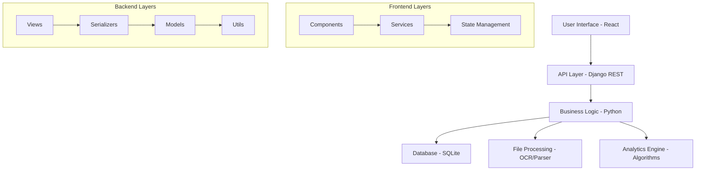
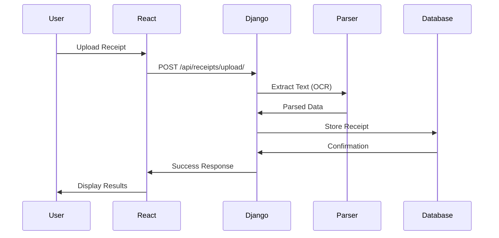
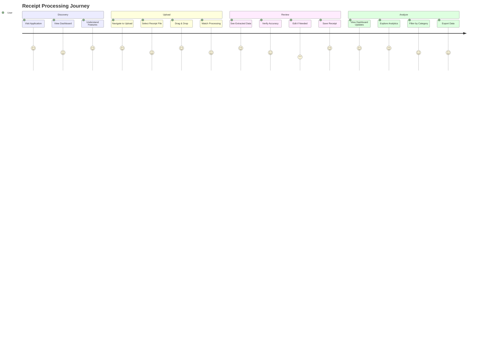

# 🧾 Receipt Processor - Smart Expense Tracking System

---

## 📑 Table of Contents

- [Overview](#overview)
- [Features](#features)
- [Demo Video](#demo-video)
- [Quick Start](#quick-start)
- [Detailed Setup](#detailed-setup)
- [Architecture](#architecture)
- [Algorithm Implementation](#algorithm-implementation)
- [Design Choices](#design-choices)
- [User Journey](#user-journey)
- [API Documentation](#api-documentation)
- [Database Schema](#database-schema)
- [Technology Stack](#technology-stack)
- [Limitations](#limitations)
- [Assumptions](#assumptions)
- [Future Enhancements](#future-enhancements)
- [Contributing](#contributing)
- [License](#license)

---

## 🌟 Overview

Receipt Processor is a full-stack web application that transforms physical receipts into digital insights through intelligent OCR processing and advanced analytics. Built for the Indian market with ₹ currency support and local vendor recognition, it demonstrates modern software engineering practices and algorithmic implementations.

### 🎯 Core Problem Solved
- **Manual Receipt Management**: Eliminates tedious manual entry of receipt data
- **Expense Tracking**: Provides intelligent categorization and spending analytics
- **Data Loss Prevention**: Digitizes and secures important financial records
- **Insights Generation**: Offers actionable spending patterns and trends

---

## ✨ Features

### 🤖 Intelligent Processing
- **Multi-format Support**: PDF, JPG, PNG, TXT file processing
- **OCR Integration**: Tesseract-powered text extraction from images
- **Rule-based Parsing**: Advanced pattern matching for Indian receipts
- **Auto-categorization**: Smart classification of expenses
- **Confidence Scoring**: AI-driven accuracy assessment

### 💼 Business Features
- **Vendor Recognition**: Pre-trained for Indian retailers (Reliance, DMart, etc.)
- **Currency Localization**: Full ₹ (INR) support with Indian number formatting
- **Category Management**: Groceries, Restaurant, Shopping, Transportation, etc.
- **Manual Corrections**: Edit parsed data with intuitive interface
- **Data Export**: CSV/JSON export with filtering options

### 📊 Advanced Analytics
- **Statistical Analysis**: Sum, mean, median, mode calculations
- **Trend Analysis**: Time-series with moving averages
- **Vendor Insights**: Frequency analysis and spending patterns
- **Category Distribution**: Visual breakdowns with interactive charts
- **Top Performers**: Ranking algorithms for high-spend vendors

### 🎨 Modern UI/UX
- **Glassmorphism Design**: Contemporary visual effects with backdrop blur
- **Responsive Layout**: Mobile-first design approach
- **Dark Mode Ready**: CSS variables for theme switching
- **Micro-animations**: Smooth transitions and hover effects
- **Accessibility**: WCAG compliant with keyboard navigation

---

## 📹 Demo Video

> 🎬 **[Watch 3-minute Demo](https://drive.google.com/file/d/1mRFM1FQhTMJyIG5wuh6NZrtp6JamKNqP/view?usp=drive_link)**
> 
> See the complete application workflow from upload to analytics in action!

---

## 🚀 Quick Start

### Prerequisites
- Python 3.8+ with pip
- Node.js 16+ with npm
- Git

### ⚡ 5-Minute Setup

```bash
# 1. Clone the repository
git clone https://github.com/yourusername/receipt-processor.git
cd receipt-processor

# 2. Backend Setup
cd backend
python -m venv venv
source venv/bin/activate  # Windows: venv\Scripts\activate
pip install -r requirements.txt
python manage.py migrate
python manage.py runserver

# 3. Frontend Setup (new terminal)
cd frontend
npm install
npm start

# 4. Access Application
# Frontend: http://localhost:3000
# Backend API: http://localhost:8000/api
```

**🎉 You're ready to go!** Upload your first receipt and watch the magic happen.

---

## 🔧 Detailed Setup

### Backend Configuration

<details>
<summary><strong>📋 Step-by-step Backend Setup</strong></summary>

#### 1. Environment Setup
```bash
cd backend
python -m venv venv

# Activate virtual environment
# Windows:
venv\Scripts\activate
# macOS/Linux:
source venv/bin/activate
```

#### 2. Install Dependencies
```bash
pip install -r requirements.txt
```

#### 3. OCR Setup (Optional but Recommended)
```bash
# Ubuntu/Debian:
sudo apt-get install tesseract-ocr

# macOS:
brew install tesseract

# Windows:
# Download from: https://github.com/UB-Mannheim/tesseract/wiki
```

#### 4. Database Setup
```bash
python manage.py makemigrations
python manage.py migrate
python manage.py createsuperuser  # Optional: for admin access
```

#### 5. Start Development Server
```bash
python manage.py runserver
```

#### 6. Verify Installation
Visit `http://localhost:8000/api/receipts/` to see the API interface.

</details>

### Frontend Configuration

<details>
<summary><strong>🎨 Step-by-step Frontend Setup</strong></summary>

#### 1. Navigate to Frontend Directory
```bash
cd frontend
```

#### 2. Install Dependencies
```bash
npm install
```

#### 3. Environment Variables (Optional)
Create `.env` file in frontend directory:
```env
REACT_APP_API_URL=http://localhost:8000/api
```

#### 4. Start Development Server
```bash
npm start
```

#### 5. Verify Installation
Visit `http://localhost:3000` to see the application.

</details>

### Production Deployment

<details>
<summary><strong>🌐 Production Setup Guide</strong></summary>

#### Backend (Django)
```bash
# Install production dependencies
pip install gunicorn whitenoise

# Collect static files
python manage.py collectstatic

# Run with Gunicorn
gunicorn receipt_processor.wsgi:application
```

#### Frontend (React)
```bash
# Build production bundle
npm run build

# Serve with nginx or any static server
npx serve -s build
```

#### Environment Variables
```bash
# Backend (.env)
DEBUG=False
SECRET_KEY=your-production-secret-key
ALLOWED_HOSTS=yourdomain.com

# Frontend (.env.production)
REACT_APP_API_URL=https://yourdomain.com/api
```

</details>

---

## 🏗️ Architecture

### System Overview



### Component Architecture

#### Backend Structure
```
backend/
├── receipt_processor/          # Django project settings
│   ├── settings.py            # Configuration & database setup
│   ├── urls.py               # URL routing
│   └── wsgi.py               # WSGI application
├── receipts/                  # Main application
│   ├── models.py             # Data models & database schema
│   ├── views.py              # API endpoints & business logic
│   ├── serializers.py        # Data serialization
│   ├── urls.py              # App-specific routing
│   ├── admin.py             # Django admin configuration
│   └── utils/               # Core algorithms & utilities
│       ├── parsers.py       # OCR & text processing
│       ├── algorithms.py    # Search, sort & analytics
│       └── validators.py    # Data validation
└── requirements.txt          # Python dependencies
```

#### Frontend Structure
```
frontend/
├── public/                    # Static assets
├── src/
│   ├── components/           # React components
│   │   ├── Dashboard.js     # Analytics overview
│   │   ├── ReceiptList.js   # Receipt management
│   │   ├── ReceiptUpload.js # File upload interface
│   │   └── Analytics.js     # Detailed analytics
│   ├── services/            # API communication
│   │   └── api.js          # HTTP client & endpoints
│   ├── utils/              # Utility functions
│   │   └── formatters.js   # Currency & date formatting
│   ├── App.js              # Main application component
│   └── index.js            # Application entry point
└── package.json             # Node.js dependencies
```

### Data Flow Architecture



---

## ⚙️ Algorithm Implementation

### Core Algorithms Implemented

#### 1. Search Algorithms
```python
# Linear Search - O(n)
def linear_search(receipts, field, value):
    results = []
    for receipt in receipts:
        if receipt.get(field) == value:
            results.append(receipt)
    return results

# Binary Search - O(log n)
def binary_search_by_date(receipts, target_date):
    # Implementation with sorted data structure
    pass
```

#### 2. Sorting Algorithms
```python
# Quick Sort - O(n log n) average case
def quick_sort_by_amount(receipts, reverse=True):
    if len(receipts) <= 1:
        return receipts
    
    pivot = receipts[len(receipts) // 2]['amount']
    left = [x for x in receipts if x['amount'] < pivot]
    middle = [x for x in receipts if x['amount'] == pivot]
    right = [x for x in receipts if x['amount'] > pivot]
    
    return quick_sort_by_amount(right) + middle + quick_sort_by_amount(left)

# Merge Sort - O(n log n) guaranteed
def merge_sort_by_vendor(receipts):
    # Stable sorting implementation
    pass
```

#### 3. Statistical Aggregations
```python
def compute_statistics(receipts):
    amounts = [float(receipt['amount']) for receipt in receipts]
    return {
        'total_spend': sum(amounts),
        'mean_spend': statistics.mean(amounts),
        'median_spend': statistics.median(amounts),
        'mode_spend': statistics.mode(amounts),
        'std_deviation': statistics.stdev(amounts)
    }
```

#### 4. Time Series Analysis
```python
def time_series_analysis(receipts, window_days=30):
    # Moving averages implementation
    # Trend analysis with sliding windows
    pass
```

### Algorithm Performance Analysis

| Algorithm | Time Complexity | Space Complexity | Use Case |
|-----------|----------------|------------------|----------|
| Linear Search | O(n) | O(1) | Small datasets, unsorted data |
| Binary Search | O(log n) | O(1) | Large sorted datasets |
| Quick Sort | O(n log n) avg | O(log n) | General purpose sorting |
| Merge Sort | O(n log n) | O(n) | Stable sorting required |
| Heap Select | O(n log k) | O(k) | Top-K elements |

---

## 🎨 Design Choices

### Frontend Design Philosophy

#### 1. Modern Glassmorphism
- **Backdrop blur effects** for depth and sophistication
- **Gradient overlays** for visual hierarchy
- **Translucent cards** with subtle borders
- **Smooth animations** for enhanced user experience

#### 2. Color Psychology
```css
Primary Colors:
- Blue (#3B82F6): Trust, reliability, technology
- Purple (#8B5CF6): Innovation, creativity
- Emerald (#10B981): Success, money, growth
- Amber (#F59E0B): Attention, warmth, energy
```

#### 3. Typography Strategy
- **Inter font family**: Modern, readable, professional
- **Gradient text effects**: Eye-catching headings
- **Consistent scale**: 8px grid system
- **Responsive sizing**: Adaptive to screen size

### Backend Design Patterns

#### 1. MVC Architecture
- **Models**: Data structure and business rules
- **Views**: Request handling and response formatting
- **Controllers**: Implicit in Django's URL routing

#### 2. Repository Pattern
- **Abstraction layer** between business logic and data access
- **Testable code** with mock implementations
- **Separation of concerns** for better maintainability

#### 3. Strategy Pattern
- **Multiple parsing strategies** for different file types
- **Pluggable algorithms** for sorting and searching
- **Configurable business rules** for categorization

### Database Design

#### Normalization Strategy
- **3NF compliance** to reduce data redundancy
- **Strategic denormalization** for performance
- **Optimized indexing** for common query patterns

```sql
-- Optimized indexes for common operations
CREATE INDEX idx_receipt_vendor_date ON receipts_receipt(vendor, transaction_date);
CREATE INDEX idx_receipt_amount_date ON receipts_receipt(amount, transaction_date);
CREATE INDEX idx_receipt_category_date ON receipts_receipt(category, transaction_date);
```

---

## 🗺️ User Journey

### Primary User Flow



### Detailed User Scenarios

#### Scenario 1: First-Time User
1. **Landing**: User arrives at clean, modern dashboard
2. **Guidance**: Clear visual cues guide to upload section
3. **Upload**: Drag-and-drop interface encourages interaction
4. **Processing**: Real-time feedback builds confidence
5. **Results**: Successful extraction creates "wow" moment
6. **Exploration**: Natural progression to analytics

#### Scenario 2: Power User
1. **Bulk Upload**: Multiple receipts processed efficiently
2. **Filtering**: Advanced search capabilities utilized
3. **Editing**: Quick corrections to parsed data
4. **Analytics**: Deep dive into spending patterns
5. **Export**: Data extraction for external analysis

#### Scenario 3: Mobile User
1. **Responsive Design**: Optimized mobile experience
2. **Touch Interface**: Large, finger-friendly buttons
3. **Camera Integration**: Direct photo upload capability
4. **Offline Capability**: Progressive Web App features

---

## 📡 API Documentation

### Authentication
Currently using Django's session authentication. For production, consider implementing JWT tokens.

### Core Endpoints

#### Receipts Management
```http
GET    /api/receipts/              # List all receipts
POST   /api/receipts/              # Create new receipt
GET    /api/receipts/{id}/         # Get specific receipt
PATCH  /api/receipts/{id}/         # Update receipt
DELETE /api/receipts/{id}/         # Delete receipt
```

#### File Processing
```http
POST   /api/receipts/upload/       # Upload and process file
```

#### Analytics
```http
GET    /api/receipts/analytics/    # Get analytics data
GET    /api/receipts/search/       # Advanced search
```

#### Data Export
```http
GET    /api/receipts/export/       # Export data (CSV/JSON)
```

### Request/Response Examples

<details>
<summary><strong>📤 Upload Receipt</strong></summary>

```http
POST /api/receipts/upload/
Content-Type: multipart/form-data

{
  "file": <binary_data>
}
```

**Response:**
```json
{
  "id": "uuid-here",
  "vendor": "Reliance Fresh",
  "amount": "450.75",
  "transaction_date": "2024-12-15",
  "category": "groceries",
  "confidence_score": 0.85,
  "created_at": "2024-12-15T10:30:00Z"
}
```

</details>

<details>
<summary><strong>📊 Get Analytics</strong></summary>

```http
GET /api/receipts/analytics/
```

**Response:**
```json
{
  "statistics": {
    "total_spend": 5420.50,
    "mean_spend": 271.03,
    "median_spend": 180.00,
    "count": 20
  },
  "category_distribution": {
    "groceries": {"total": 2100.00, "count": 8},
    "restaurant": {"total": 1200.00, "count": 6}
  },
  "top_vendors": [
    {"vendor": "Reliance Fresh", "total_spend": 1200.00}
  ],
  "time_series": {
    "dates": ["2024-12-01", "2024-12-02"],
    "amounts": [450.75, 320.00],
    "moving_avg": [450.75, 385.38]
  }
}
```

</details>

---

## 🗄️ Database Schema

### Core Tables

#### receipts_receipt
```sql
CREATE TABLE receipts_receipt (
    id UUID PRIMARY KEY DEFAULT uuid_generate_v4(),
    file VARCHAR(100) NOT NULL,
    vendor VARCHAR(200) NOT NULL,
    transaction_date DATE NOT NULL,
    amount DECIMAL(10,2) NOT NULL CHECK (amount >= 0),
    category VARCHAR(50) NOT NULL DEFAULT 'other',
    raw_text TEXT,
    confidence_score REAL DEFAULT 0.0,
    created_at TIMESTAMP WITH TIME ZONE DEFAULT NOW(),
    updated_at TIMESTAMP WITH TIME ZONE DEFAULT NOW()
);

-- Optimized indexes
CREATE INDEX idx_receipt_vendor_date ON receipts_receipt(vendor, transaction_date);
CREATE INDEX idx_receipt_amount_date ON receipts_receipt(amount, transaction_date);
CREATE INDEX idx_receipt_category_date ON receipts_receipt(category, transaction_date);
CREATE INDEX idx_receipt_created_at ON receipts_receipt(created_at);
```

### Data Relationships
- **Receipts**: Self-contained entities with all necessary information
- **Future Extensions**: User management, receipt sharing, category customization

---

## 💻 Technology Stack

### Backend Technologies
| Technology | Version | Purpose |
|------------|---------|---------|
| **Python** | 3.8+ | Core programming language |
| **Django** | 4.2.7 | Web framework & ORM |
| **Django REST Framework** | 3.14.0 | API development |
| **SQLite** | Built-in | Database (dev), PostgreSQL (prod) |
| **Pydantic** | 2.5.0 | Data validation |
| **PyPDF2** | 3.0.1 | PDF text extraction |
| **Pillow** | 10.1.0 | Image processing |
| **Pytesseract** | 0.3.10 | OCR engine |

### Frontend Technologies
| Technology | Version | Purpose |
|------------|---------|---------|
| **React** | 18.2.0 | UI library |
| **React Router** | 6.8.0 | Client-side routing |
| **Axios** | 1.6.0 | HTTP client |
| **Chart.js** | 4.4.0 | Data visualization |
| **Tailwind CSS** | 3.3.0 | Utility-first CSS |
| **Date-fns** | 2.30.0 | Date manipulation |

### Development Tools
- **Git**: Version control
- **npm**: Package management
- **pip**: Python package management
- **Django Admin**: Database administration
- **Browser DevTools**: Debugging and testing

---

## ⚠️ Limitations

### Current Limitations

#### 1. OCR Accuracy Constraints
- **Image Quality Dependency**: Blurry or low-resolution images may yield poor results
- **Language Support**: Optimized primarily for English text
- **Handwritten Text**: Limited support for handwritten receipts
- **Complex Layouts**: Struggles with heavily formatted or unusual receipt designs

#### 2. Scale Limitations
- **File Size**: Maximum 10MB per upload
- **Concurrent Users**: SQLite limitations for high-traffic scenarios
- **Storage**: Local file storage (not cloud-optimized)
- **Processing Time**: Large files may experience delays

#### 3. Feature Limitations
- **Real-time Collaboration**: No multi-user editing capabilities
- **Mobile App**: Web-only, no native mobile applications
- **Offline Support**: Requires internet connection for full functionality
- **Advanced ML**: No machine learning model training capabilities

#### 4. Geographic Limitations
- **Currency Support**: Currently optimized for INR (₹) only
- **Vendor Database**: Limited to Indian retailers and common international brands
- **Date Formats**: Primarily DD/MM/YYYY (Indian) and MM/DD/YYYY (US) formats
- **Tax Calculations**: No automatic tax computation or compliance features

### Performance Constraints

#### Database
- **SQLite Limits**: Concurrent write limitations
- **Query Performance**: Large datasets may require optimization
- **Backup Strategy**: Manual backup processes

#### File Processing
- **Memory Usage**: Large files consume significant RAM
- **Processing Speed**: OCR operations are CPU-intensive
- **Error Recovery**: Limited retry mechanisms for failed uploads

---

## 📋 Assumptions

### Technical Assumptions

#### 1. User Environment
- **Modern Browsers**: Chrome 90+, Firefox 88+, Safari 14+, Edge 90+
- **JavaScript Enabled**: Full functionality requires JavaScript
- **File System Access**: Users can access and upload local files
- **Internet Connection**: Stable connection for optimal performance

#### 2. Receipt Formats
- **Standard Structure**: Receipts follow common vendor/amount/date patterns
- **Readable Text**: Text is machine-readable and not severely degraded
- **English Language**: Primary language for text extraction
- **Digital Format**: Scanned or digital receipts preferred over photos

#### 3. Usage Patterns
- **Individual Users**: Designed for personal expense tracking
- **Moderate Volume**: Hundreds, not thousands of receipts per user
- **Regular Usage**: Consistent upload patterns for meaningful analytics
- **Data Accuracy**: Users will review and correct parsed data when needed

### Business Assumptions

#### 1. User Behavior
- **Privacy Conscious**: Users comfortable uploading financial documents
- **Tech Savvy**: Basic computer literacy assumed
- **Goal-Oriented**: Users seeking expense insights, not just storage
- **Feedback Provision**: Users will report issues and inaccuracies

#### 2. Market Conditions
- **Indian Market Focus**: Primary target audience in India
- **Digital Adoption**: Increasing acceptance of digital financial tools
- **Compliance**: No special regulatory requirements assumed
- **Competition**: Differentiation through superior UX and accuracy

### Data Assumptions

#### 1. Receipt Content
- **Complete Information**: Receipts contain vendor, amount, and date
- **Consistent Formats**: Vendors maintain relatively consistent receipt layouts
- **Currency Clarity**: Amount clearly indicated with ₹ symbol or context
- **Date Standards**: Dates follow recognizable DD/MM/YYYY or MM/DD/YYYY formats

#### 2. Storage and Security
- **Local Development**: Initial deployment on local/development servers
- **Data Retention**: Users responsible for their own data backup
- **Security Model**: Basic authentication sufficient for MVP
- **Compliance**: No PCI-DSS or strict financial regulations assumed

---

## 🚀 Future Enhancements

### Phase 1: Core Improvements (Q1 2025)
- [ ] **Enhanced OCR**: Integration with Google Vision API or AWS Textract
- [ ] **Mobile App**: React Native implementation for iOS/Android
- [ ] **Batch Processing**: Multiple file upload with progress tracking
- [ ] **Receipt Templates**: Custom templates for better parsing accuracy

### Phase 2: Advanced Features (Q2 2025)
- [ ] **Machine Learning**: Custom ML models for vendor/category classification
- [ ] **Multi-currency**: Support for USD, EUR, and other major currencies
- [ ] **Cloud Storage**: Integration with AWS S3 or Google Cloud Storage
- [ ] **Real-time Sync**: Live updates across multiple devices

### Phase 3: Enterprise Features (Q3 2025)
- [ ] **Multi-tenant**: Support for teams and organizations
- [ ] **Advanced Analytics**: Predictive spending models and forecasting
- [ ] **API Integrations**: Connect with accounting software (QuickBooks, Xero)
- [ ] **Compliance Tools**: Tax reporting and audit trail features

### Phase 4: AI & Automation (Q4 2025)
- [ ] **Smart Categorization**: AI-powered expense categorization
- [ ] **Expense Policies**: Automated policy compliance checking
- [ ] **Receipt Generation**: Create digital receipts for cash transactions
- [ ] **Voice Interface**: Voice-powered receipt entry and queries

---

## 🤝 Contributing

We welcome contributions! Please see our [Contributing Guidelines](CONTRIBUTING.md) for details.

### Quick Contribution Guide
1. Fork the repository
2. Create a feature branch (`git checkout -b feature/amazing-feature`)
3. Commit your changes (`git commit -m 'Add amazing feature'`)
4. Push to the branch (`git push origin feature/amazing-feature`)
5. Open a Pull Request

### Development Setup for Contributors
```bash
# Setup development environment
git clone https://github.com/yourusername/receipt-processor.git
cd receipt-processor

# Install pre-commit hooks
pip install pre-commit
pre-commit install

# Run tests
cd backend && python manage.py test
cd frontend && npm test
```

---

## 📄 License

This project is licensed under the MIT License - see the [LICENSE](LICENSE) file for details.

---

## 🙏 Acknowledgments

- **Django Community**: For the excellent web framework
- **React Team**: For the powerful UI library
- **Tesseract OCR**: For open-source text recognition
- **Tailwind CSS**: For the utility-first CSS framework
- **Chart.js**: For beautiful data visualizations

---

## 📞 Support

- **Documentation**: [Wiki Pages](https://github.com/yourusername/receipt-processor/wiki)
- **Issues**: [GitHub Issues](https://github.com/yourusername/receipt-processor/issues)
- **Discussions**: [GitHub Discussions](https://github.com/yourusername/receipt-processor/discussions)
- **Email**: support@receiptprocessor.com

---


**Made with ❤️ for smarter expense tracking**

⭐ Star this repository if you found it helpful!

